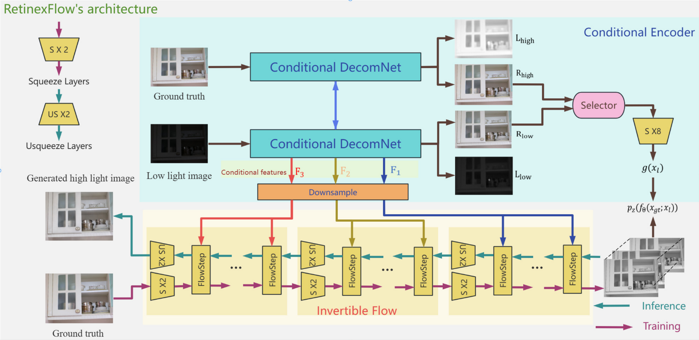

# RetinexFlow: Retinex-based Conditional Normalizing Flow for Low-light Image Enhancement
By Min Xu, Hanbo Tu, Ziyu Yue, Zhixun Su
## pipeline

## Quantitative results
### Evaluation on LOL

### Visual Results

## Dependencies and Installation
```
cd RetinexFlow
conda create -n RetinexFlow python=3.8
conda activate RetinexFlow
pip install -r code/requirements.txt
```
## Download the datasets
LOL: Chen Wei, Wenjing Wang, Wenhan Yang, and Jiaying Liu. "Deep Retinex Decomposition for Low-Light Enhancement", BMVC, 2018. [[Baiduyun (extracted code: sdd0)]](https://pan.baidu.com/s/1spt0kYU3OqsQSND-be4UaA) [[Google Drive]](https://drive.google.com/file/d/18bs_mAREhLipaM2qvhxs7u7ff2VSHet2/view?usp=sharing) <br>
LOL-v2 (the extension work): Wenhan Yang, Haofeng Huang, Wenjing Wang, Shiqi Wang, and Jiaying Liu. "Sparse Gradient Regularized Deep Retinex Network for Robust Low-Light Image Enhancement", TIP, 2021. [[Baiduyun (extracted code: l9xm)]](https://pan.baidu.com/s/1U9ePTfeLlnEbr5dtI1tm5g) [[Google Drive]](https://drive.google.com/file/d/1dzuLCk9_gE2bFF222n3-7GVUlSVHpMYC/view?usp=sharing) <br> <br>
## Pre-trained Models
Download the pre-trained models and place them in `./pretrained_models/`: You can download our pre-trained model from


